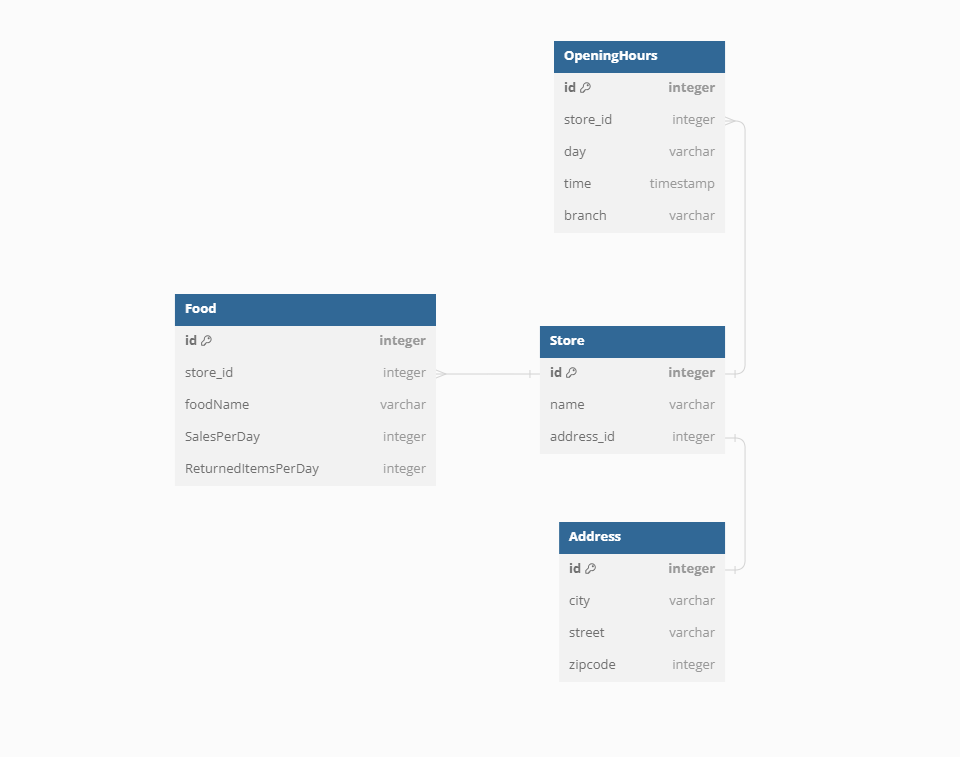

- [Goal](#goal)
- [Analysis](#analysis)
  - [Database](#database)
  - [API](#api)
- [Agile development process](#agile-development-process)
- [Existing features](#existing-features)
- [Test scenario](#test-scenario)
- [Validation](#validation)
- [Development](#development)
- [Aknowledgement](#aknowledgement)


# Goal
Build a simple REST API using Django, which should allow users to perform the following actions:
- Create a new store
- Retrieve a single store by ID
- Retrieve a list of all stores
- Update an existing store (with all fields)
- Delete an existing store


# Analysis
According to the requirements, two tables will be created and added to the existing database that Django Framework offers.
And inorder to have an API out of these tables, i am going to use the Django Serializer to transform the models into JSON format.


## Database
The ERD below shows two tables `Store` and `Address`, connected as One To One relationship.

I assumed the data that have been expressed in the requirements could be structured as follow.
The Table `Address` has got three data members, `name`: a string, `address`: an object reference the `Address` table, and finally the `openingHours`: an optional field, has three options (06:00 AM, 09:00 AM, 12:00PM).




## API
In my case, it's necessary to transform the `Store` and `Address` tables data into a JSON data, and this will result in having  key/value pairs.
The following is an example of the resulted API.

```bash
{
    "stores": [
        {
            "id": 1,
            "name": "Nona fahrrad laden",
            "address": {
                "id": 1,
                "city": "Bernau",
                "state": "Barnim",
                "zipcode": 16321
            },
            "openingHours": "00:06 AM"
        }
    ]
}
```

# Agile development process
The development process went smoothly with the use of the Github roadmap project board.
I named my project in the Github **foodTrack-Assessment**.
I created and prioritized  the issues according to `MOSCOW`.
I have followed the iterative approach, each sprint last for 5 days.
- **Sprint 1 (Dec 13th To 17th, 2023)**
    - [x] [Setup the development environment](https://github.com/Nazek-Altayeb/FoodTrack_Assessment/issues/1) <code style="color:red">Must have</code>
    - [x] [CRUD store](https://github.com/Nazek-Altayeb/FoodTrack_Assessment/issues/2) <code style="color:red">(Must have)</code>
    - [x] [Authorization and permission](https://github.com/Nazek-Altayeb/FoodTrack_Assessment/issues/3) <code style="color:'red'">Must have</code>
    - [x] [Validation and error handling](https://github.com/Nazek-Altayeb/FoodTrack_Assessment/issues/4) <code style="color:red">Must have</code>
    - [x] [Add pagination and filtering](https://github.com/Nazek-Altayeb/FoodTrack_Assessment/issues/5) <code style="color:red">Must have</code>


# Test scenario
1. Run the server `python manage.py runserver`
2. With the use of Postman  API hub , add the following `/stores` to the given link 
    - choose GET, as a result all items will be listed in JSON format.
    - choose GET and add `/<int>` : `the int must be an existing store-Id` to the existing link , as a result only the mean item details will be displayed.
    - choose POST, enter a new store details except the `Ids`, as a result a new store is created and displayed as well in the response area. 
    - choose PUT, copy and paste one of the existing stores details, then manipulate the data, as a result the store details will be changed with the new ones.
    - choose DELETE, and add `/<int>` : `the int must be an existing store-Id`  to the existing link, the mean item should be no more exist in the list.
3. Try to add random ending to the url, not found message will be displayed.


# Validation
- Testing against python files has been perfomed using Python Linter, the following are the results.....(TO DO )


# Development

## Clone
Changes made to a cloned repository will affect the original one.

- Navigate to the main page of the repostitory (this could be a forked instance)
- Click on the **Code** dropdown menu above the list of files
- Choose a method to copy the URL for the repository: either via **HTTPS**, by using an **SSH key**, or by using **GitHub CLI**
- In your work environment, open Git Bash and change current directory to target location for cloned repository
- Type ``git clone`` followed by the copied URL and press enter **Enter**

## Fork

Any changes made to a forked repository do not affect the original repository.

- Log into GitHub and click on repository to download ([FoodTrack_Assessment](https://github.com/Nazek-Altayeb/FoodTrack_Assessment))
- Click the **Fork** buttonin the top right-hand corner
- Select a different owner if necessary
- Click **Create Fork**
- The repo is now in your chosen account and can be cloned or changed:

# Aknowledgement

- I programmed the project my self.
- I benefit from my recent experience in programming backend using Django REST Framework.
- I look for existing resources and examples, those demostrate Nested Serializers