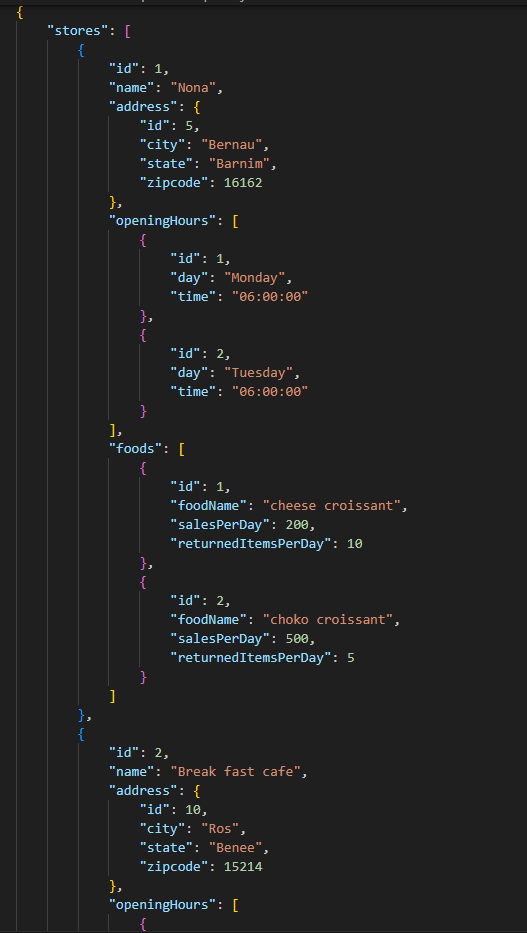

- [Goal](#goal)
- [Analysis](#analysis)
- [User stories](#user-stories)
  - [Database](#database)
  - [API](#api)
- [Agile development process](#agile-development-process)
- [Existing features](#existing-features)
- [Test scenario](#test-scenario)
- [Development](#development)
- [Aknowledgement](#aknowledgement)

# Goal
Build a simple and flexible REST API using Django, the api should consist of a number of nested objects and every nested object could be added individually, modified and deleted also.

# Analysis
I assumed the data that have been expressed in the `Test case` requirements could be extended by adding more properties, so the API could express more specific details about the `Store`.
The process of creating the API will start be creating the database tables first, then i am going to use the Django Serializer to transform the models into JSON format, and the functionalities that perform the CRUD.

# User stories
User stories has been divided and done within fixed iterations, each iteration last for 5 days.

### **Epic 1 - Main functionalities**
- As a user i can create a `Store` and fill it with data, so i can use it.
- As a user i can retrieve all  `Stores` data, so i can review them.
- As a user i can retrieve a single `Store` data, so i can manipulate all of some of it's details.
- As a user i can update an existing `Store` data, so i can have up to date data.
- As a user i can remove a `Store` data, so i can keep my API clean from unnecessary data. 

### **Epic 2 - Extend the Store properties**
- As a user i can add  `OpeningHours` times individually for specific `store`.
- As s user i can retrieve the list of `OpeningHours` that the `Store` offers, so i can review this data.
- As a user i can retrieve  the `OpeningHours` of every `Branch` per each day, so i can update the `OpeningHours` for specific days (considering that every store has got different branches).
- As a user i can add  `Foods` items  individually for specific `store`.
- As s user i can retrieve the list of `Foods` that the `Store` offers, so i can review this data.
- As a user i can update specific  `Foods` item  , so i so i can have up to date `Foods` data.
- As a user i can remove a `Foods` data, so i can keep my API clean from unnecessary data.  

## Database
The ERD below shows 4 tables, mainly the `Store` is connected to three tables `Address` `OpeningHours` `Food` through `OneToOne` and `OneToMany` relationships.

## API
In my case, it's necessary to transform the models into a JSON data, and this will result in having  key/value pairs.
The following is an example of the resulted API.
This API comes with an ability to edit every nested object and modify it individually, delete it or add a new one.

# Agile development process
The development process went smoothly with the use of the Github roadmap project board.
I named my project in the Github **foodTrack-Assessment**.
I created and prioritized  the issues according to `MOSCOW`.
I have followed the iterative approach, each sprint last for 5 days.
- **Sprint 1 (Dec 13th To 17th, 2023)**
    - [x] [Setup the development environment](https://github.com/Nazek-Altayeb/FoodTrack_Assessment/issues/1) Must have
    - [x] [CRUD store](https://github.com/Nazek-Altayeb/FoodTrack_Assessment/issues/2) Must have
    - [x] [Authorization and permission](https://github.com/Nazek-Altayeb/FoodTrack_Assessment/issues/3) Must have
    - [x] [Validation and error handling](https://github.com/Nazek-Altayeb/FoodTrack_Assessment/issues/4) Must have
    - [x] [Add pagination and filtering](https://github.com/Nazek-Altayeb/FoodTrack_Assessment/issues/5) Must have
    - [x] [Extend Store model, add new properties](https://github.com/Nazek-Altayeb/FoodTrack_Assessment/issues/6)should have

- **Sprint 2 (Dec 18th To 22nd, 2023)**
    - [x] [Add opening time individually](https://github.com/Nazek-Altayeb/FoodTrack_Assessment/issues/7)should have
    - [x] [Add opening time individually](https://github.com/Nazek-Altayeb/FoodTrack_Assessment/issues/8)should have

# Existing features
1. Retrieve all sets of `Store` data , update or delete specific Store data according to a given `store_Id`.
2. Update the `Store` and it's nested objects according to a given `store_Id`.
3. Retrieve all `Foods` data.
4. Add new `Foods` items, according to a given `store_id`.
5. update or delete specific Food item according to a given `food_id`.
6. Retrieve all `OpeningHours` data.
7. Add new `OpeningHours` times, according to a given `store_id`.
8. update or delete specific Food item according to a given `openingHour_id`.

# Test scenario
1. Run the server `python manage.py runserver`, keep the `server link`.
2. With the use of Postman  API hub (or any similar tool), add  the following urls to the given `server link` and perform following tests.

### Test against the Store 
- choose GET, add `/stores` as a result all stores objects will be listed in a JSON format.
- choose GET add `/stores/<int>` : `the int must be an existing store-Id` , as a result only the mean store  details will be displayed.
- choose POST, add `/stores/` enter a new store details except the `Id`, as a result a new store is created and displayed as well in the response area. 
- choose PUT, add  add `/stores`,  copy and paste one of the existing stores details, then manipulate the data, as a result the store details will be changed with the new ones.
- choose DELETE, and add `/stores/<int>` : `the int must be an existing store-Id`  to the existing link, the mean item should be no more exist in the list.

### Test against the Opening times
- choose GET, add `/openingHours` as a result all opening times  objects will be listed in a JSON format.
- choose GET add `/openingHours/<int>` : `the int must be an existing openingHours-Id` , as a result only the mean opening time  details will be displayed.
- choose POST, add `/addOpeningHour/<int>` : `the int must be an existing store-Id`enter a new opening time  , as a result a new opening time  is created as a nested object in the specified store. Results will be  displayed in the response area. 
- choose PUT, add `/openingHours/<int>` : `the int must be an existing openingHours-Id`,  copy and paste one of the existing opening time  details, then manipulate the data, as a result the opening time details will be changed with the new ones.
- choose DELETE, and add `/openingHours/<int>` : `the int must be an existing openingHours-Id`  to the existing link, the mean item should be no more exist in the list.

### Test against the Food 
- choose GET, add `/openingHours` as a result all opening times  objects will be listed in a JSON format.
- choose GET add `/openingHours/<int>` : `the int must be an existing openingHours-Id` , as a result only the mean opening time  details will be displayed.
- choose POST, add `/addOpeningHour/<int>` : `the int must be an existing store-Id`enter a new opening time, as a result a new opening time  is created as a nested object in the specified store. Results will be  displayed in the response area. 
- choose PUT, add `/openingHours/<int>` : `the int must be an existing openingHours-Id`,  copy and paste one of the existing opening time  details, then manipulate the data, as a result the opening time details will be changed with the new ones.
- choose DELETE, and add `/openingHours/<int>` : `the int must be an existing openingHours-Id`  to the existing link, the mean item should be no more exist in the list.

# Development

## Clone
Changes made to a cloned repository will affect the original one.

- Navigate to the main page of the repostitory (this could be a forked instance).
- Click on the **Code** dropdown menu above the list of files.
- Choose a method to copy the URL for the repository: either via **HTTPS**, by using an **SSH key**, or by using **GitHub CLI**.
- In your work environment, open Git Bash and change current directory to target location for cloned repository.
- Type `git clone` followed by the copied URL and press enter **Enter**.
- Create a virtual environment, and install the required libraries, then execute the following command if needed `Set-ExecutionPolicy Unrestricted -Scope Process`, then activate the virtaul environment ` . .venv/Scripts/activate`.
- Create superuser, use the credentials to create authentication token.

## Fork

Any changes made to a forked repository do not affect the original repository.

- Log into GitHub and click on repository to download ([FoodTrack_Assessment](https://github.com/Nazek-Altayeb/FoodTrack_Assessment)).
- Click the **Fork** buttonin the top right-hand corner.
- Select a different owner if necessary.
- Click **Create Fork**.
- The repo is now in your chosen account and can be cloned or changed:

# Aknowledgement

- I programmed the project my self.
- I benefit from my recent experience in programming backend using Django REST Framework.
- I look for existing resources and examples, those demonstrate Nested Serializers.